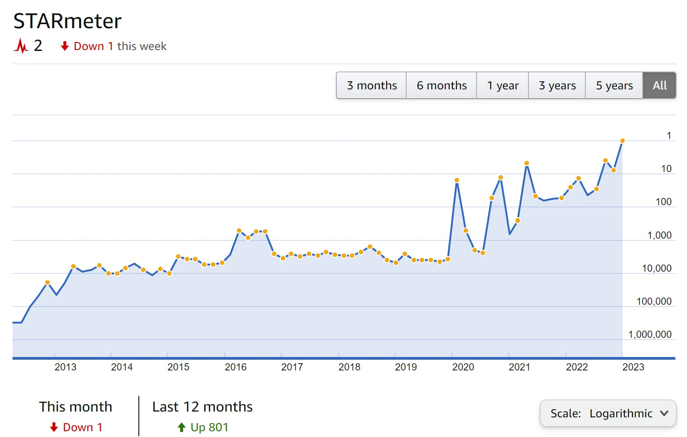
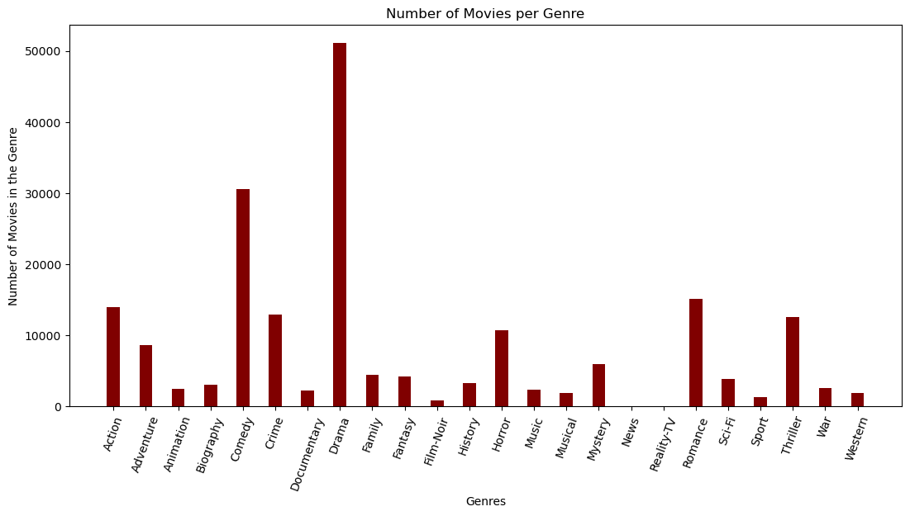

# Analyzing the Movie Universe

**Author**: [Alison Peebles Madigan](mailto:alison.peeblesmadigan@flatironschool.com)

## Overview

This project is dedicated to the study of the film industry. Each movie has its own unique attributes that are meant to appeal to a certain audience. Some movies are for romantics, others are for war buffs, and some movies are just meant to make everybody laugh. Reguardless of the intention, this project attempts to predict how well a new movie will be recieved by the public before it is released. Movie studios like "Fox" or "Warner Brothers" can use this model to try and predict how a potential movie would do in the real world before even making it.

## Step By Step:
The steps for this project are as follows:
- **Gather a basic dataset of movies**: this will be done using web scraping
- **Collect as many extra features as possible**: this is also achieved with scraping
- **Clean the data**: removing nans and outliers
- **Split up the dataset by Genre**: this allows for models that are easier build
- **Format each dataframe for Neural Network Regression**: this means all of the categorical data is in 1s and 0s
- **Make one model specifically for each Genre**: this will make each model more accurate for its given genre

## Data

The Basic Data for this project came from IMDB.com. The information for each movie was scraped using BeautifulSoup

This included: runtime, actors, directors, writers, rating, number of reviews, production companies, and serveral other categorical data points.

The Advanced Data about the popularity metrics for each individual actor, director, and writer came from IMDBPro.com

this allowed me to collect a popularity metric for year of each persons career

Ultimately between IMDB and IMDBPro, I scraped over 450,000 movies. Of these only about 100,000 movies had enough data to be used in the modeling.

## Divide by Genre

As you can see there is a significant imbalence between the different movie genres in the dataset. This required the process of splitting up the dataset into 16 subsets so that each genre could get its own model. Each column of each subset was then transformed into numerics so that it could be fed into the regression model.

## Modeling

I used StandardScaler(), PCA(), Neural Networks, and CrossValidation() in order to product the best model for each Genre. There was some variability between the different models but they all followed the basic setup shown in the figure above.

## Results

Across all of the models I got varying results but ultimatly the average mse and mae hovered around 1, and 0.8:

- **Action**: MSE = 1.15, MAE = 0.84
- **Adventrue**: MSE = 1.09 , MAE = 0.82
- **Animation**: MSE = 1.34, MAE = 0.98
- **Comedy**: MSE = 0.7704 , MAE = 0.674
- **Crime**: MSE = 0.9053, MAE = 0.7478
- **Drama**: MSE = 0.89, MAE = 0.74
- **Family**: MSE = 1.19 , MAE = 0.837
- **Fantasy**: MSE = 1.25, MAE = 0.9
- **History**: MSE = 1.14 = , MAE = 0.85
- **Horror**: MSE = 1.17, MAE = 0.87
- **Mystery**: MSE = 1.45, MAE = 0.85
- **Romance**: MSE = 0.86, MAE = 0.73
- **Sci-Fi**: MSE = 1.4, MAE = 0.92
- **Thriller**: MSE = 1.01, MAE = 0.83
- **War**: MSE = 1, MAE = 0.76
- **Western**: MSE = 0.85 , MAE = 0.74

## Conclusions

the analysis of the differnt genres led me to a few conclusions:

- **There is a limit to what can be done**: this model cannot take into account the sublte details in the movie because it does not have access to metrics for those details (like individual actor perforance, chemistry between professionals, or real life events that could effect ticket sales)

- **A lot of room for Growth**: the fact that most of the models could predict within one point of the true metric with the limited data that it had shows that with more work and access to more data, these models could get significantly more accurate than they already are

- **Opinion plays a large factor**: thoughout these models there is a bias from the audience watching the movie that the model cannot take into account. Some people like one type of movie over another and vise versa.

### Next Steps

- **Acquiring more data**: for each genre will obviously help the accuracy scores all around

- **Acquiring more Budget data**: I was hard pressed to find budget info for more than one fourth of the 100,000 movies I used for this dataset. In the future I would hunt for a source that could fill in that blank

- **More specific modeling**: I would want to create more datasets that are crosses between two big genres such as romantic/comedy or action/thriller

